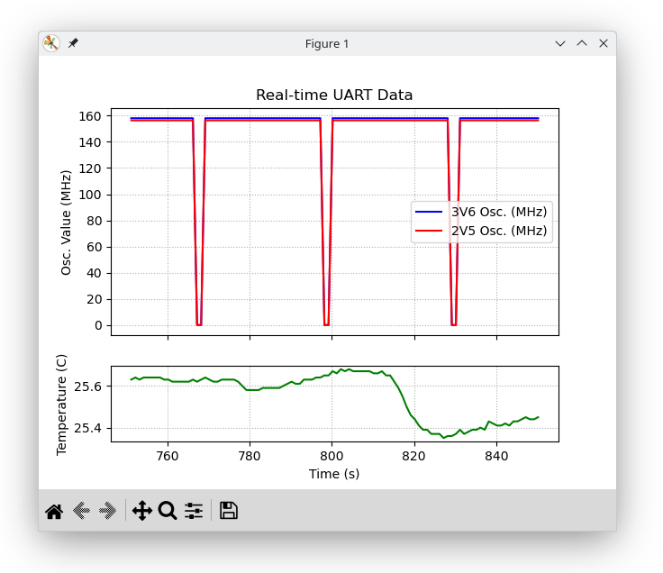
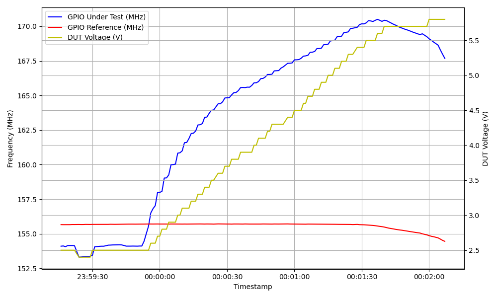

# :bulb: 3.3V GPIO Tolerance Evaluation for GateMate FPGA

* [Introduction](#introduction)
* [Test Methodology and Expectations](#test-methodology-and-expectations)
* [Implementation](#implementation)
* [Results](#results)

> [!NOTE]
> This project is currently still in progress.

## Introduction

Building 3.3V tolerant GPIO cells in silicon is becoming increasingly challenging as semiconductor process nodes continue to shrink, primarily due to several interrelated factors, including the thickness of the gate oxide. The [GateMate FPGA](https://colognechip.com/programmable-logic/gatemate/) Series is manufactured in Globalfoundries' 28nm SLP process, and feature GPIOs that accommodate voltage levels from 1.2V to 2.5V. Although most interacting components were available with 1.8V compatibility, 3.3V compatibility is still frequently required.

This project documents the test methodology and contains a collection of tests and their results to investigate the 3.3V tolerance of the 2.5V-rated GPIOs.

> [!WARNING]
> Using these tests _can_ lead to permanent damage to the affected GPIOs!

### Industry Standard Considerations

According to the [data sheet](https://colognechip.com/docs/ds1001-gatemate1-datasheet-latest.pdf), GateMate's single-ended GPIO support LVCMOS and LVTTL, compliant to the standards JESD8-5 and JESD8-7. Both standards do not appear to be publicly accessible, but only after registration to the [JEDEC](https://www.jedec.org/) organization.

In the context of the upcoming investigations, it seems obvious to cross-referencing to JESD8C, the interface standard for nominal 3V/3.3V supplies, as well.

#### Absolute maximum continuous ratings

| Standard    | Supply Voltage, VDD |
| :---------- | :------------------ |
| JESD8-5A.01 | -0.5V to 3.6V       |
| JESD8C      | -0.5V to 4.6V       |

#### Recommended operating conditions

| Standard    | Supply Voltage, VDD           |
| :---------- | :---------------------------- |
| JESD8-5A.01 | 1.8V to 2.7V (Wide Range)     |
| JESD8C      | 2.7V to 3.6V (Extended Range) |

## Test Methodology and Expectations

### :repeat: GPIO Ring Oscillators

We will implement a ring oscillator on the GPIOs to measure frequency variations under different voltage stress conditions, as they are highly sensitive to changes in the electrical properties of the circuit. When the GPIOs are exposed to over-voltage conditions, these properties can shift, which directly impacts the oscillation frequency.

1. **Detect Electrical Degradation**: Changes in frequency can indicate issues such as increased leakage current, degraded switching speed, or internal damage to the GPIO cells.
2. **It Provides a Quantifiable Metric**: Frequency shifts are easy to measure and provide a clear, quantifiable metric for evaluating how well the GPIOs tolerate over-voltage stress.

#### Oscillator Instance

A GPIO ring oscillator essentially consists of a bidirectional `CC_IOBUF` primitive, whose `A` output is fed back to the inverted `Y` input, which leads to oscillation at the bidirectional `IO` port, which can be measured at the FPGA GPIO. All additional parameters are deactivated, the slew rate control is deactivated and the drive is always configured to the lowest value of 3mA. The oscillator can also be switched on and off via the output enable port `T` in order to test its function during the test.

```verilog
    CC_IOBUF #(
        .DRIVE("12"),        // "3", "6", "9" or "12" mA
        .SLEW("SLOW"),       // "SLOW" or "FAST"
        .PULLUP(0),          // 0: disable, 1: enable
        .PULLDOWN(0),        // 0: disable, 1: enable
        .KEEPER(0),          // 0: disable, 1: enable
        .SCHMITT_TRIGGER(0), // 0: disable, 1: enable
        .DELAY_IBF(4'd0),    // input delay: 0..15
        .DELAY_OBF(4'd0),    // input delay: 0..15
        .FF_IBF(1'b0),       // 0: disable, 1: enable
        .FF_OBF(1'b0)        // 0: disable, 1: enable
    ) iobuf_inst (
        .A(~io_lb),
        .T(osc_halt), // 0: output, 1: input
        .Y(io_lb),
        .IO(osc_io)
    );
```

#### Frequency Counter

Instead of having to use an external oscilloscope with several channels, it is possible to use the feedback signal `io_lb` as a clock for a simple counter. Test measurements have shown that the oscillator oscillates in the 200 MHz range, so that the register width of 32 bits should provide enough depth.

```verilog
    reg [31:0] osc_counter = 0;

    // ringosc counter
    always @(posedge io_lb or posedge osc_rst)
    begin
        if (osc_rst == 1) begin
            osc_counter <= 0;
        end
        else begin
            osc_counter <= osc_counter + 1'b1;
        end
    end
```

Furthermore, an external constant reference clock is required to document the exact number of oscillations per second. This can be realized by an additional counter, which in this case oscillates at a constant rate of 10 MHz and registers the counter reading of the oscillator after every second that has elapsed.

```verilog
    parameter REF_CLK = 10_000_000;
    reg [31:0] ref_counter = 0;

    // 1 sec sample
    always @(posedge ref_clk)
    begin
        ref_counter <= ref_counter + 1'b1;
        if (ref_counter == REF_CLK) begin
            ref_counter <= 0;
            // store oscillator value
        end
    end
```

#### Regular Oscillator Halts

This is a kind of health check of the oscillator, which can be triggered every `N` samples. To do this, the oscillator is stopped and restarted. The frequency counter must be able to detect that no oscillation is taking place during the stops.

```verilog
    parameter STP_SMPL = 30; // / no. of samples until 1s osc halt
    wire stp_clk = (ref_counter == 0);
    reg [$clog2(STP_SMPL)-1:0] stp_counter = 0;

    // stop counter: triggers each STP_SMPL samples
    always @(posedge stp_clk)
    begin
        stp_counter <= stp_counter + 1'b1;
        if (stp_counter == STP_SMPL) begin
            stp_counter <= 0;
        end
    end

    assign osc_halt = (stp_counter == 0);
```

#### UART Interface

In order to be able to evaluate the counter values, they are sent using a naive multi-word UART for each sample.

```verilog
    uart_tx #(
        .CLK_RATE(REF_CLK),
        .BAUD_RATE(115200),
        .WORD_LEN(8),
        .WORD_COUNT(8),
        .PARITY("L"),
        .STOP(1)
    ) tx_inst (
        .clk_i(ref_clk),
        .tx_start_i(ref_counter == 0),
        .tx_data_i(/* stored oscillator values in bytes */),
        .tx_done_o(uart_tx_done),
        .tx_busy_o(uart_tx_busy),
        .tx_o(uart_tx)
    );
```

### :wrench: Test Setup

For the test setup we will be using and modifying the official GateMate FPGA development board. To be more precise, the board is not permanently fitted with an FPGA, but has a socket with which the FPGA is connected to the board by applying a contact pressure. This wil be particularly helpful if chips are damaged during the test and need to be replaced. The board already features several voltage regulators for different GPIO voltages, which can usually be switched via jumper settings on the banks. Fortunately, there is already a controller configured for 3.3V. On the evaluation board, it is exclusively used for the Pmod-compatible level shifters.

To test for operation at 3.3V with a sufficient margin, we configure the regulator to the absolute maximum continuous rating of 3.6V that is specified in JESD8-5A.01. To achieve this, it is required to set `R1=100k` and `R2=20k` for the feedback loop of the [MPM3833C](https://www.monolithicpower.com/en/mpm3833c.html):


| V_out (V) | R1 (kOhm) | R2 (kOhm) |
| :-------: | :-------: | :-------: |
|       1.8 |  200 (1%) |       100 |
|       2.5 |  200 (1%) |      63.2 |
|       3.3 |  200 (1%) |      44.2 |
|       3.6 |  100 (1%) |        20 |

It is now possible to supply the respective banks with 3.6V via the `VDDIO` jumper blocks using a cable from `JP14`.


In ring oscillator mode, the GPIOs under test would oscillate without a connected load. To avoid this and achieve more comparable results, it is worthwhile to add a capacitive load of 15pF to each GPIO under test. To ensure that the capacity can be charged by the driver, the GPIO output driver is configured to 12mA.


### :bar_chart: Data Acquisition

:construction: WIP



## Results

:construction: WIP

### :fire: How far can we go?
> [!CAUTION]
> This **will** lead to permanent damage to the chip!

Fortunately, I have a socket for the BGA324 package and am literally sitting at the FPGA source, so I can go overboard with some testing. To do this, we feed in 2.5V with an external current source and regularly increase the voltage in 10mV steps.



Starting at 2.3V and initially setting the external current source to 2.5V shows a ring oscillator frequency of 154 MHz, while the static 2.5V reference bank oscillates at ~155 MHz, which is plausible. At 2.5V, the current comsumption of the tested bank is 8mA. As the voltage increases, the current consumption also increases in addition to the oscillator frequency:

| V_IO (V) | Current (mA) |
| :------: | -----------: |
|      2.5 |            8 |
|      3.0 |           12 |
|      3.3 |           13 |
|      3.6 |           15 |
|      4.0 |           17 |
|      4.5 |           20 |
|      5.0 |           26 |
|      5.2 |           29 |
|      5.4 |           34 |
|      5.6 |           48 |
|      5.7 |   70+ :boom: |
|      5.9 | 1,344 :boom: |

From 5.7v it can be observed that the current starts to rise abruptly. From this point onwards, a starting influece can also be detected on the reference bank, and the oscillator frequencies drop on both banks. At 5.9V the current rises up to 1.344mA (7.9W!) until the chip switches off; from this point on it is permanently damaged.

:construction: WIP